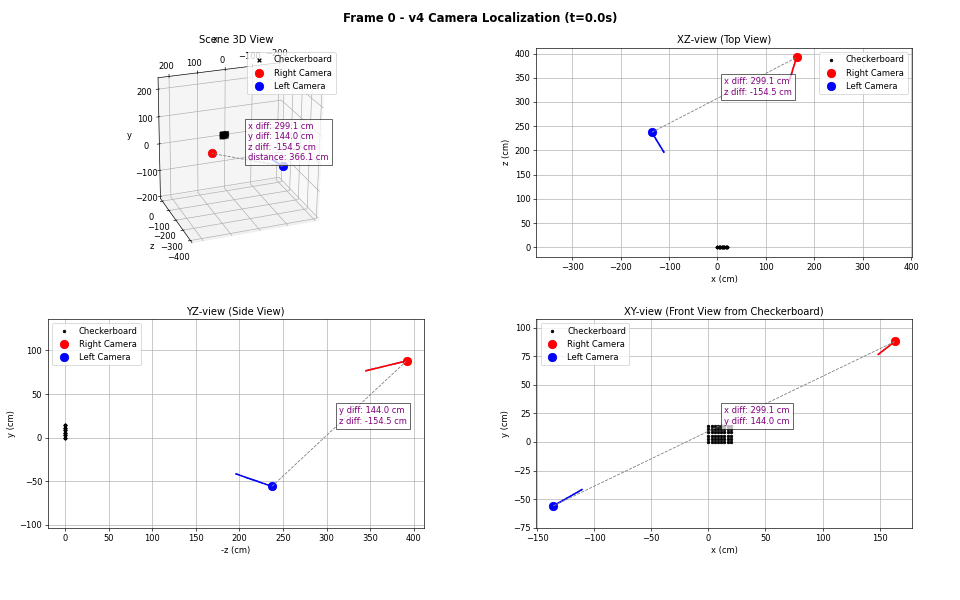

# Camera Geolocation Project

Localizes a moving camera in 3D (relative to a checkerboard-defined world frame) from video, and validates the estimated positions against tape-measured ground truth.

## How to Run

```bash
pip install -r requirements.txt

python project_v4.py         # current pipeline: writes camera_positions_v4.json
python compare_accuracy.py   # v3-vs-v4 accuracy comparison + scale diagnostic
python visualize_v4.py       # interactive 4-panel plot with frame slider
python visualize_v4.py --gif # render visualization_v4.gif headless

# previous versions
python project_v2.py
python project_v3.py
```

## Results



**Headline: 32 cm mean absolute localization error at 2.5–4 m working distance — a 2.5× improvement over v3 — from a checkerboard that spans only ~60–90 pixels of the frame.**

Highlights:

- **All four validated endpoints land in a tight 29–39 cm band** (v3: 30–169 cm). Consistency is the win: no endpoint is an outlier anymore, which means the pipeline's error is now dominated by physical measurement issues, not algorithm failures.
- **Root-caused a genuinely subtle failure mode:** an 8×6 checkerboard is *exactly* 180°-symmetric (corner grid and coloring), so the mirror pose fits every frame with identical reprojection error — no per-frame or frame-to-frame method can distinguish them. Diagnosed it from the data, proved single-frame disambiguation is impossible, and solved it globally.
- **Sub-0.1 px pose fits** on the undistorted, subpixel-refined corners (right camera 0.05–0.12 px across the entire sequence), on top of a 0.39 px intrinsic calibration over 70 frames.
- **No hand-tuned parameters left:** the v3 pipeline needed hand-measured initial poses and two magic smoothness weights; v4 needs neither — `solvePnP` candidates plus a global dynamic-programming pass replace all of it.
- **The remaining ~30 cm bias is explained and falsifiable:** a constant 1.09 radial ratio across endpoints points to the printed square size (~2.56 cm vs the assumed 2.8 cm). One ruler measurement settles it, and correcting the scale would bring the mean error to ~18 cm.

| Metric | v3 | v4 |
|---|---:|---:|
| Start: left / right camera error | 30.2 / 41.2 cm | **29.8 / 38.6 cm** |
| End: left / right camera error | 84.8 / 169.2 cm | **28.5 / 31.0 cm** |
| Mean absolute positioning error | 81.3 cm | **32.0 cm** |
| Mean positioning error | 56.6 % | **20.0 %** |

The v3 end-frame blow-up turned out to be the **180° symmetry of an 8×6 checkerboard**: the mirror pose fits every single frame exactly as well as the true pose (the corner grid *and* the square coloring map onto themselves under a 180° rotation), and `findChessboardCorners` silently reverses its corner ordering as the camera moves around the board — so the sequential tracker drifted onto the mirror branch. v4 resolves it globally: `cv2.solvePnPGeneric` (IPPE) enumerates both planar-pose solutions for both corner orderings per frame, and a dynamic-programming pass picks the smoothest track through all candidates, anchored at the tape-measured start pose.

Other v4 fixes: corners are undistorted with the calibrated distortion model, subpixel refinement uses a window scaled to the corner spacing (the board is only ~60–90 px wide in these videos — a standard (11,11) window overlaps neighboring corners and corrupts the detection), detection failures are checked and logged, and per-frame reprojection RMS is reported.

**Remaining error:** the four validated endpoints are a consistent ~9 % too far radially — a constant multiplicative ratio, i.e. a scale error in the assumed board geometry rather than a pose problem (best-fit scale 0.913 ⇒ square size ~2.56 cm instead of the assumed 2.8 cm, consistent with "fit to page" print shrink; a single global scale drops the mean error to ~18 cm). To verify: measure the printed board across 7 squares (19.6 cm if truly 2.8 cm, ~17.9 cm if shrunk), set `square_size_cm` in `ground_truth.yaml`, and rerun. Intrinsics are ruled out: the calibrated focal corresponds to 24.6 mm vs the nominal 24 mm lens, and a denser 70-frame recalibration moved it by only 0.2 %.

## Files

**project_v4.py** - Current localization pipeline (headless): distortion-corrected, spacing-aware subpixel corners, IPPE pose candidates, global branch disambiguation, per-frame reprojection RMS. Writes `camera_positions_v4.json`.

**visualize_v4.py** - Interactive slider figure / gif export from the v4 JSON.

**compare_accuracy.py** - Prints the v3-vs-v4 error table against `ground_truth.yaml`.

**calibrate_v3.py** - Fixed intrinsic calibration (full-res subpixel refinement, reports RMS, saves full K + distortion).

**ground_truth.yaml** - Single source of truth for the tape-measured camera positions and board geometry.

**project_v3.py** - Previous version: camera localization from video (calibrates intrinsic and extrinsic from video). Shows plot with slider on the bottom to move through frames. Prints error stats to terminal. Superseded by project_v4.py (see the v4 results section above for what was wrong).


**project_v2.py** - Script to perform camera localization from images. Shows plot with multiple view angles and prints error stats in terminal.

**visualization_v4.gif** - gif of the v4 result plot (generated by `visualize_v4.py --gif`)

**visualization.gif** - gif of the plot generated from project_v3.py (note: contains the mirror-branch artifact in the right camera's second half)

**camera_animation.gif** - gif of selection of frames from Left and Right Camera for project_v3.py

**validate.py** - Runs error analysis

**calibrate_v2.py** - Modified calibrate script provided from Assignment 3

**camutils.py** and **visutils.py** - Provided from Assignment 3

**attributes.yaml** - Picture and video location and data

## Data

**data/checkerboard2/** - Main 6x8 checkerboard used for project_v2 and project_v3

**data/checkerboard2/videos/** - Contains:
- `left.MP4` - Left camera video for project_v3
- `right.MP4` - Right camera video for project_v3
- `camera_positions.json` - JSON storing all of the location data for project_v3

**data/checkerboard2/positions1/** - Images for extrinsic calibration/localization for project_v2

**data/checkerboard2/calibrate/2/** - Images for intrinsic calibration for project_v2

**data/checkerboard2/calibrate/video/** - Video for intrinsic calibration for project_v3

**data/checkerboard1/** - Failed 7x7 checkerboard
